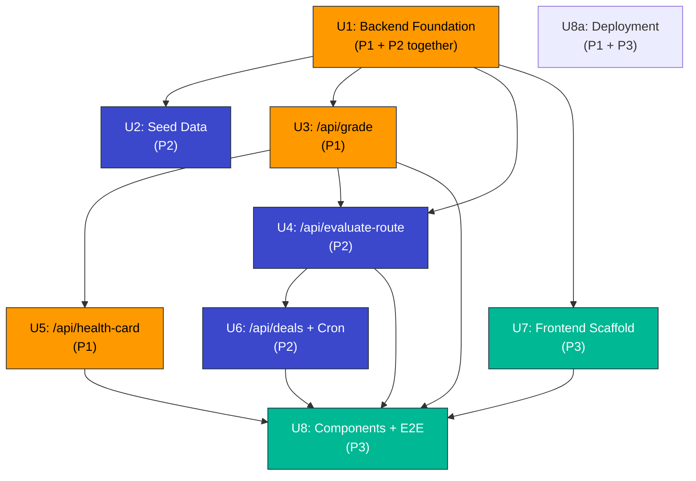

# feat: ReRoute v3 — Final Stack Migration

> **Origin document**: `architecture-v3-final.md` (brainstorming)
> **Target repo**: `amazonHackOn/ReRoute/`
> **Prior art**: v2 foundation layer (18 files, ~1,300 lines, Lambda + DynamoDB + Streamlit)
>
> Migrate the existing AI grading pipeline and cascade routing engine from Lambda/DynamoDB/Streamlit to FastAPI/PostgreSQL/Next.js. All business logic is built and tested — this plan covers the wrapper migration and new layers.

---

## Problem Frame

The v2 architecture (Lambda + DynamoDB + Streamlit) was built for maximum solo-build speed. It succeeded — `grade_item` and `route_evaluator` are functional with 7/7 tests passing. The final stack (Next.js + FastAPI + PostgreSQL) is required for demo impact: SSR frontend, relational database for judging credibility, warm container for no cold starts, and OpenAPI auto-docs for API visibility.

The migration is a **refactor of the API layer** — all business logic (condition multipliers, cascade formulas, ring price floors, routing thresholds, Rekognition/Bedrock call patterns, JSON extraction fallback, grading prompt) stays unchanged. The work is: replace Lambda handlers with FastAPI endpoints, DynamoDB CRUD with SQLAlchemy ORM, and Streamlit tabs with Next.js pages.

---

## Scope Boundaries

### In Scope
- FastAPI backend with 4 API endpoints (`/api/grade`, `/api/evaluate-route`, `/api/health-card`, `/api/deals`)
- SQLAlchemy ORM models (7 tables with FK constraints) + Alembic migration
- PostgreSQL seeder consuming existing `seed/*.json` files
- Refactor of `grade_item` and `route_evaluator` business logic into services
- New `health_card_service` (Claude 3.5 Sonnet prose + QR code generation)
- Next.js 14 App Router frontend with 3 pages + 5 components
- Cron Lambda for ring progression (only Lambda kept from v2)
- App Runner + Amplify deployment configuration

### Deferred to Follow-Up Work
- Stripe/Paytm payment integration (demo uses "Buy → Confirmed!" screen)
- Amazon Cognito authentication (demo uses hardcoded personas)
- Real-time WebSocket price updates (demo uses static ring progression chart)
- Dynamic radius expansion based on demand data
- Multi-image grading (averaging across 2-3 photos)

### Outside This Product's Identity
- Return prevention (size/brand suggestions at purchase)
- Green Credits gamification
- Amazon Pay mock flow
- Real GPS integration (text-based distance used instead)

---

## Key Technical Decisions

| Decision | Rationale | Source |
|---|---|---|
| Bedrock Nova Lite for grading (not Claude 3.5) | Speed + cost. Nova Lite is optimized for structured JSON extraction. Lower risk of markdown fence issues | architecture-v3-final |
| Claude 3.5 Sonnet for health cards (not Nova Lite) | Prose quality matters for consumer-facing trust documents | architecture-v3-final |
| SQLAlchemy ORM (not raw SQL or asyncpg directly) | Django-style declarative models, Alembic auto-migration, team familiarity | repo patterns |
| Pydantic schemas separate from SQLAlchemy models | Clean API contract validation vs DB persistence. FastAPI auto-generates OpenAPI from Pydantic | FastAPI convention |
| Cron Lambda for ring progression (not FastAPI background task) | Fire-and-forget. No need for a 24/7 scheduler on App Runner. Lambda is the right tool for scheduled invocation | architecture-v3 |
| App Router (not Pages Router) | File-based routing maps naturally to our 3-page structure. Server Components reduce client JS | Next.js 14 docs |
| CSS Modules (not Tailwind) | No framework overhead. 3 pages don't need a utility-class library | team constraint |

---

## High-Level Technical Design

### Component Architecture

```
Next.js App Router (Amplify)
│
├── page.tsx                   POST multipart → /api/grade
│   └── GradingCard.tsx        Displays GradingReport fields
│
├── deals/page.tsx             GET → /api/deals
│   ├── DealCard.tsx            Single listing with price + distance
│   └── PriceTrajectory.tsx     Plotly.js line chart
│
└── relist/page.tsx            POST → /api/grade (c2c mode) → /api/health-card
    ├── HealthCard.tsx          Nutrition-label card
    └── QRDisplay.tsx           Base64 PNG display

FastAPI Backend (App Runner)
│
├── POST /api/grade             → grade_service.py  → Rekognition + Bedrock Nova Lite
├── POST /api/evaluate-route    → routing_service.py → cascade formulas + listing
├── POST /api/health-card       → health_card_service.py → Claude 3.5 + qrcode
├── GET /api/deals              → direct SQLAlchemy query on floating_discounts
│
└── db/
    ├── database.py             engine + sessionmaker
    ├── models.py               SQLAlchemy ORM (7 tables)
    └── seed.py                 Reads seed/*.json → SQLAlchemy inserts

Cron Lambda (every 24h)
└── advance_rings.py            → calls routing_service.advance_to_next_ring()
```

### Data Flow (Grading + Routing)

```
┌─────────┐   POST multipart    ┌─────────────┐   boto3   ┌───────────┐
│ Next.js  │ ──────────────────> │ FastAPI      │ ────────> │ Rekognit. │
│ page.tsx │ <────────────────── │ /api/grade   │ <──────── │           │
└─────────┘   GradingReport     └──────┬──────┘           └───────────┘
                                       │
                                   boto3│
                                  ┌─────▼──────┐
                                  │  Bedrock   │
                                  │  Nova Lite │
                                  └─────┬──────┘
                                       │ condition JSON
                                  ┌─────▼──────┐
                                  │ PostgreSQL │
                                  │ grad_reports│
                                  └─────┬──────┘
                                       │
┌─────────┐   POST JSON         ┌─────▼──────┐
│ deals/   │ ──────────────────> │ FastAPI      │
│ page.tsx │ <────────────────── │ /eval-route  │
└─────────┘   RoutingDecision   └──────┬──────┘
                                       │ cascade + listing
                                  ┌─────▼──────┐
                                  │ PostgreSQL │
                                  │ float_disc  │
                                  └────────────┘
```

This illustrates the intended approach and is directional guidance for review, not implementation specification.

---

## System-Wide Impact

| Affected Party | Impact |
|---|---|
| **v2 lambdas/** | `grade_item/` and `route_evaluator/` retired. Business logic extracted into `backend/app/services/`, handler wrappers deleted |
| **v2 lambdas/shared/** | `config.py` → `backend/app/core/config.py`. `models.py` → split into Pydantic schemas + SQLAlchemy ORM. `db.py` retired |
| **v2 seed/** | `.json` files kept. `seed_dynamodb.py` retired, replaced by `backend/app/db/seed.py` |
| **v2 app.py** | Replaced by `frontend/app/` with 3 Next.js pages + 5 components |
| **New: backend/** | FastAPI app, 4 endpoints, 3 services, 7 ORM models, Alembic migrations, Docker/App Runner config |
| **New: frontend/** | Next.js 14, TypeScript, 3 pages, 5 components, `lib/api.ts`, Amplify config |
| **New: docs/plans/** | This plan file |
| **New: lambdas/cron/** | Only Lambda kept: `advance_rings.py` for ring progression |

---

## Implementation Units

### Phase 1: Backend Skeleton

### U1. Backend Configuration and Database Foundation

**Goal**: Establish the FastAPI skeleton with all configuration, database connection, ORM models, and Alembic migration. This is the foundation every other unit builds on.

**Requirements**: All 18 v2 config constants carried forward. 7 PostgreSQL tables matching v2 DynamoDB schemas with added FK constraints. SQLAlchemy async engine for boto3 compatibility.

**Dependencies**: None (first unit)

**Files**:
- `backend/app/core/config.py` — REFACTOR from `lambdas/shared/config.py`
- `backend/app/db/database.py` — NEW
- `backend/app/db/models.py` — NEW
- `backend/app/db/migrations/` — NEW (Alembic)
- `backend/requirements.txt` — NEW
- `backend/app/main.py` — NEW (FastAPI app, CORS)

**Approach**:
1. Copy all constants from `lambdas/shared/config.py`. Drop 7 `TABLE_*` constants. Add `DATABASE_URL` (read from env). Swap `BEDROCK_MODEL_GRADING` → `amazon.nova-lite-v1:0`. Add `BEDROCK_MODEL_HEALTH_CARD = "anthropic.claude-3-5-sonnet-20241022-v2:0"`.
2. Create SQLAlchemy engine + `async_sessionmaker` in `database.py`. No async needed for boto3 calls — sync sessionmaker is fine since boto3 is sync.
3. Define 7 ORM models in `models.py`: `Item`, `GradingReport`, `FloatingDiscount`, `HubCheckpoint`, `HealthCard`, `Transaction`, `AbuseFlag`. Each with FK constraints (`item_id` references `items.item_id`).
4. Run `alembic init` + `alembic revision --autogenerate` for initial migration.
5. `main.py`: create FastAPI app, add CORS middleware (allow all origins for dev), register empty router prefixes.

**Patterns to follow**: Standard FastAPI project layout (`app/core/`, `app/db/`, `app/api/routes/`). SQLAlchemy declarative base with `Mapped` types from `sqlalchemy.orm`.

**Test scenarios**:
- `backend/app/core/config.py` imports without errors and all constants from v2 are present
- `backend/app/db/models.py` imports and all 7 model classes can be instantiated
- Alembic migration runs without errors and creates all 7 tables in PostgreSQL
- FK constraint: inserting a `grading_report` with a non-existent `item_id` raises IntegrityError
- `main.py` starts with `uvicorn` and responds to `GET /` with 200

**Verification**:
- `python -c "from app.core.config import *; print(AWS_REGION, BEDROCK_MODEL_GRADING)"` succeeds
- `alembic upgrade head` completes with all 7 tables visible in `\dt`
- `uvicorn app.main:app` starts on port 8000

---

### U2. Seed Data Migration

**Goal**: Migrate the v2 DynamoDB seeder to PostgreSQL via SQLAlchemy, consuming the same 3 JSON files unchanged.

**Requirements**: Seed 10 products, 12 hub checkpoints, 3 floating discounts (with pre-calculated trajectory), 3 personas. Must be idempotent (re-running doesn't duplicate data). Must support `--reset` flag.

**Dependencies**: U1 (PostgreSQL tables must exist)

**Files**:
- `backend/app/db/seed.py` — NEW (replaces `seed/seed_dynamodb.py`)

**Approach**:
1. Read `seed/products.json`, `seed/trajectories.json`, `seed/personas.json`.
2. Drop existing rows if `--reset` flag (use `session.execute(delete(Model))`).
3. Insert via SQLAlchemy `session.add_all()`, `session.commit()`.
4. For trajectory products: compute `v_graded`, C_remaining, MVSP, discount_pct, sale_price using the existing cascade formulas. Create `FloatingDiscount` rows with pre-calculated `trajectory` JSONB field (same as v2).
5. Print summary: tables created, records inserted, time taken.

**Patterns to follow**: Same seeding logic as `seed/seed_dynamodb.py` but using SQLAlchemy ORM instead of boto3 DynamoDB.

**Test scenarios**:
- `python -m app.db.seed` inserts 10 items, 12 checkpoints, 3 discounts, 3 personas without errors
- `python -m app.db.seed --reset` runs twice: second run should have same record count (idempotent)
- Trajectory product PROD_001 has 4 hub checkpoints with decreasing C_remaining
- Floating discount for PROD_001 has status "active", discount_pct ~47.2, sale_price ~316

**Verification**:
- `SELECT count(*) FROM items` returns 10
- `SELECT count(*) FROM hub_checkpoints` returns 12
- `SELECT count(*) FROM floating_discounts` returns 3
- PROD_001 floating discount: `v_graded_inr ≈ 359.40`, `mvsp_inr ≈ 239.40`

---

### Phase 2: API Endpoints

### U3. Grading Endpoint (`POST /api/grade`)

**Goal**: Refactor the v2 `grade_item` lambda into a FastAPI endpoint. Same two-stage pipeline (Rekognition + Bedrock Nova Lite), same prompt, same JSON extraction fallback.

**Requirements**: Accept multipart form with 2-3 images + metadata. Call Rekognition (non-fatal). Build grading prompt. Call Bedrock Nova Lite. Parse JSON response. Return GradingReport. Save to PostgreSQL.

**Dependencies**: U1 (config, models, database), U2 (seed data for testing)

**Files**:
- `backend/app/services/grade_service.py` — REFACTOR from `lambdas/grade_item/lambda_function.py`
- `backend/app/api/routes/grade.py` — NEW (FastAPI router)

**Approach**:
1. Extract 6 functions from `lambda_function.py` into `grade_service.py`: `run_rekognition()`, `build_grading_prompt()`, `call_bedrock_vision()`, `extract_json_from_response()`, `determine_route()`, `build_grading_report()`.
2. Change `call_bedrock_vision()`: use `BEDROCK_MODEL_GRADING` which is now `amazon.nova-lite-v1:0`. Same messages API format. Same base64 encoding. Same retry-on-throttle.
3. `grade.py` route handler: accept `UploadFile` list via FastAPI `File(...)`. Write to S3 first (boto3 `put_object`). Then call `grade_service` functions. Save `GradingReport` to PostgreSQL via SQLAlchemy. Return as JSON.
4. Keep `determine_route()` as preliminary — route_evaluator recalculates with real MVSP.

**Patterns to follow**: FastAPI `APIRouter` with `@router.post("/grade")`. Multipart form handling with `fastapi.UploadFile`. Same boto3 patterns as v2.

**Test scenarios**:
- `POST /api/grade` with valid images returns 200 with condition_grade, confidence, defects
- Rekognition failure returns 200 with empty `rekognition_labels` array (non-fatal)
- Invalid JSON from Bedrock triggers `extract_json_from_response` fallback (markdown fence handling)
- GradingReport row appears in PostgreSQL after successful call
- Covers the Return Center user flow: Priya uploads shoes → gets grading result

**Verification**:
- `curl -X POST /api/grade -F "images=@shoe_1.jpg" -F "item_id=PROD_001" -F "original_price_inr=599"` returns 200 with JSON body
- `SELECT * FROM grading_reports WHERE item_id = 'PROD_001'` returns 1 row

---

### U4. Routing Endpoint (`POST /api/evaluate-route`)

**Goal**: Refactor the v2 `route_evaluator` lambda into a FastAPI endpoint. Same cascade auction model, same ring price floors, same formulas.

**Requirements**: Load GradingReport from PostgreSQL. Compute graded_value, full_return_cost, overhead_ratio. Apply gate (7% overhead, 85% confidence). Run cascade: compute profitable radius → ring price → create FloatingDiscount → return routing decision.

**Dependencies**: U1, U3 (grading must exist to route)

**Files**:
- `backend/app/services/routing_service.py` — REFACTOR from `lambdas/route_evaluator/lambda_function.py`
- `backend/app/api/routes/routing.py` — NEW

**Approach**:
1. Extract 8 functions from `lambda_function.py` into `routing_service.py`: `load_grading_report()`, `compute_full_return_cost()`, `should_enter_reroute()`, `compute_profitable_radius()`, `compute_ring_price()`, `create_floating_discount_listing()`, `advance_to_next_ring()`, `_route_response()`.
2. Change DB calls: `get_item(TABLE_GRADING_REPORTS, ...)` → `session.query(GradingReport).filter_by(item_id=...).first()`. `put_item(TABLE_FLOATING_DISCOUNTS, ...)` → `session.add(FloatingDiscount(...)); session.commit()`.
3. `routing.py` route handler: accept JSON body with item_id, original_price_inr, category, current_location, ring_index. Call `routing_service` orchestration. Return routing response.
4. `advance_to_next_ring()` stays as a standalone function importable by the Cron Lambda.

**Patterns to follow**: Same FastAPI router pattern as U3. SQLAlchemy query patterns for joins when needed.

**Test scenarios**:
- Priya's shoes (PROD_001): overhead 33.4% → enters cascade → route = reroute_deals → price ~316 at Ring 0
- Test all 5 fast exits: Poor→recycle, Like New+≥2000→amazon_renewed, overhead<7%→standard_return, confidence<85%→standard_return, radius=0→donate
- Ring progression: price at Ring 0 < Ring 1 < Ring 2 < ... < Home Warehouse
- FloatingDiscount row appears in PostgreSQL after successful call
- Covers the routing decision flow: grading → evaluate → listing created

**Verification**:
- `POST /api/evaluate-route` with PROD_001 data returns `{"final_route": "reroute_deals", "entered_reroute": true, "overhead_ratio": 0.334}`
- `SELECT * FROM floating_discounts WHERE item_id = 'PROD_001'` returns 1 row with `status = 'active'`

---

### U5. Health Card Endpoint (`POST /api/health-card`)

**Goal**: Generate an AI-written Product Health Card with QR code. New endpoint — no v2 counterpart exists yet.

**Requirements**: Accept item_id and seller info. Load GradingReport from PostgreSQL. Generate health assessment prose via Bedrock Claude 3.5 Sonnet. Generate QR code PNG → base64 via `qrcode` lib. Return HealthCard JSON with card_uuid, card_url, qr_code_base64, condition summary, immutable flag.

**Dependencies**: U1, U3 (grading must exist)

**Files**:
- `backend/app/services/health_card_service.py` — NEW
- `backend/app/api/routes/health_card.py` — NEW

**Approach**:
1. Load GradingReport from PostgreSQL.
2. Build Claude prompt for health prose: "You are Amazon's product condition verifier. Write a consumer-facing health assessment for this item..." Include condition grade, defects, brand_guess, product_category from grading report.
3. Call Bedrock Claude 3.5 Sonnet (`BEDROCK_MODEL_HEALTH_CARD`). Parse prose response.
4. Generate QR code: `qrcode.QRCode(box_size=10, border=2)`, encode card URL, render PNG, base64 encode.
5. Generate `card_uuid` using `generate_card_uuid("MUM")` from models.py.
6. Save to PostgreSQL `health_cards` table. Return HealthCard JSON.

**Patterns to follow**: Same Bedrock call pattern as U3 but with Claude 3.5 instead of Nova Lite. Same QR code generation as v2 architecture doc described for `health_card` lambda.

**Test scenarios**:
- `POST /api/health-card` with PROD_002 (Rahul's baby monitor) returns 200 with card_uuid, qr_code_base64
- card_uuid matches format `HC-2026-MUM-XXXXXXXX`
- qr_code_base64 is a valid base64-encoded PNG (starts with `iVBORw0KGgo`)
- HealthCard row appears in PostgreSQL with `amazon_guarantee = true`
- Covers the C2C listing flow: Rahul uploads → grades → gets health card with QR

**Verification**:
- Response `card_uuid` is non-null and matches expected format
- Decoding `qr_code_base64` produces a valid PNG image
- `SELECT * FROM health_cards WHERE item_id = 'PROD_002'` returns 1 row

---

### U6. Deals Endpoint + Cron Lambda

**Goal**: Read-only marketplace endpoint + ring progression cron. Together these power the ReRoute Deals page.

**Requirements**:
- `GET /api/deals`: query floating_discounts filtered by hub_id (optional), status='active'. Return list sorted by discount_pct descending.
- Cron Lambda: deploy `advance_to_next_ring()` from `routing_service.py`. Fire every 24h. Update sale_price, ring_index, discount_pct, expires_at for unsold listings.

**Dependencies**: U4 (routing_service must have `advance_to_next_ring()`)

**Files**:
- `backend/app/api/routes/routing.py` — MODIFY (add `@router.get("/deals")`)
- `lambdas/cron/advance_rings.py` — NEW (Lambda wrapper around `routing_service.advance_to_next_ring()`)

**Approach**:
1. `GET /api/deals`: simple SQLAlchemy query on `FloatingDiscount` model with optional `.filter_by(hub_id=...)`. Return list of dicts via Pydantic schema.
2. `lambdas/cron/advance_rings.py`: import `advance_to_next_ring` from `backend.app.services.routing_service`. Lambda handler: query all active listings → for each, call `advance_to_next_ring()`. Log ring transitions. Deploy via Lambda console.

**Patterns to follow**: FastAPI query param pattern. Lambda handler pattern from v2 (same handler(event, context) signature, deployed as standalone zip).

**Test scenarios**:
- `GET /api/deals` returns 3 active listings (from seed data)
- `GET /api/deals?hub_id=MUM_H1` filters correctly
- Cron Lambda: calling `advance_rings.handler({})` advances PROD_001 from ring 0 to ring 1, updates sale_price from ~316 to ~327
- Cron Lambda: calling again advances to ring 2, sale_price ~334

**Verification**:
- `GET /api/deals` returns JSON array with length 3
- After cron runs: `SELECT ring_index FROM floating_discounts WHERE item_id = 'PROD_001'` returns 1 (was 0)

---

### Phase 3: Frontend

### U7. Frontend Scaffold and API Client

**Goal**: Next.js 14 App Router skeleton with all 3 pages, shared layout, and API client. Routing and navigation work. Pages display static content.

**Requirements**: 3 pages matching demo storyboard. App Router layout with navigation tabs. TypeScript API client wrapping all 4 FastAPI endpoints.

**Dependencies**: U3, U4, U5, U6 (all API endpoints must exist)

**Files**:
- `frontend/app/layout.tsx` — NEW
- `frontend/app/page.tsx` — NEW (Return Center)
- `frontend/app/deals/page.tsx` — NEW (ReRoute Deals marketplace)
- `frontend/app/relist/page.tsx` — NEW (ReList C2C)
- `frontend/lib/api.ts` — NEW (fetch wrappers)
- `frontend/package.json` — NEW
- `frontend/tsconfig.json` — NEW
- `frontend/next.config.js` — NEW
- `frontend/amplify.yml` — NEW

**Approach**:
1. Bootstrap: `npx create-next-app@14 frontend --typescript --app --no-tailwind --src-dir=false`.
2. `layout.tsx`: nav bar with 3 links (Return Center, ReRoute Deals, ReList C2C). Amazon brand color (#ff9900) on header.
3. `page.tsx`: file upload form (multipart). Submit button. Loading state. Result display area.
4. `deals/page.tsx`: fetch from `/api/deals` on mount. Render list of deal cards (static for now).
5. `relist/page.tsx`: file upload + seller info form. Submit triggers `/api/grade` then `/api/health-card`.
6. `lib/api.ts`: typed `fetch()` wrappers. `gradeProduct(formData)`, `evaluateRoute(data)`, `generateHealthCard(data)`, `getDeals(params)`. All return typed responses.

**Patterns to follow**: Next.js 14 App Router conventions. Server Components by default, `'use client'` for interactive pages. `fetch()` with `Content-Type: application/json` or `multipart/form-data`.

**Test scenarios**:
- All 3 pages render without errors (`npm run dev` → navigate to all routes)
- Navigation between pages works via header links
- `page.tsx` file upload form renders and accepts images
- `deals/page.tsx` calls `GET /api/deals` and logs response to console (before components exist)
- `api.ts` exports all 4 functions with correct TypeScript types

**Verification**:
- `npm run build` succeeds with no TypeScript errors
- `npm run dev` serves on localhost:3000 with all 3 pages accessible
- Browser dev tools shows API calls succeeding (200 responses)

---

### U8. Frontend Components and End-to-End Integration

**Goal**: Build 5 visual components. Wire all pages to real API responses. Demo flow works end-to-end.

**Requirements**: GradingCard (condition badge + defect list), DealCard (price + discount + distance + "Buy" button), PriceTrajectory (Plotly.js ring progression chart), HealthCard (nutrition-label style), QRDisplay (base64 PNG). All 3 demo flows (upload→grade→route→listing, upload→grade→health card, browse deals→buy) work end-to-end.

**Dependencies**: U7 (pages must exist)

**Files**:
- `frontend/components/GradingCard.tsx` — NEW
- `frontend/components/DealCard.tsx` — NEW
- `frontend/components/PriceTrajectory.tsx` — NEW
- `frontend/components/HealthCard.tsx` — NEW
- `frontend/components/QRDisplay.tsx` — NEW
- `frontend/app/page.tsx` — MODIFY (wire to API)
- `frontend/app/deals/page.tsx` — MODIFY (wire to API)
- `frontend/app/relist/page.tsx` — MODIFY (wire to API)

**Approach**:
1. `GradingCard`: receives `GradingReport` props. Displays condition grade as colored badge (green=Like New, blue=Good, orange=Fair, red=Poor). Renders defect list with severity icons. Shows confidence bar.
2. `DealCard`: receives `FloatingDiscount` props. Shows product name, current price (large), original price (strikethrough), discount %, distance. "Buy Now" button triggers abuse check + "Confirmed!" screen.
3. `PriceTrajectory`: receives trajectory array. Renders Plotly.js line chart with hub labels on X axis, price on Y axis. Annotated with discount % at each point.
4. `HealthCard`: receives `HealthCard` props. Nutrition-label layout: product name, condition grade (large), defect summary, confidence score, "Amazon AI Verified" badge, QR code (via QRDisplay).
5. `QRDisplay`: receives `qr_code_base64` string. Renders ``.
6. Wire `page.tsx`: on form submit → calls `api.gradeProduct()` → displays `GradingCard` result → auto-triggers `api.evaluateRoute()` → displays `DealCard` + `PriceTrajectory`.
7. Wire `deals/page.tsx`: on mount → calls `api.getDeals()` → maps to `DealCard` components. Click "Buy" → shows confirmation.
8. Wire `relist/page.tsx`: on form submit → calls `api.gradeProduct()` → then `api.generateHealthCard()` → displays `HealthCard` with QR.

**Patterns to follow**: TypeScript props interfaces matching Pydantic schema shapes. React state with `useState()`. `useEffect()` for data fetching. `'use client'` directive on all interactive pages.

**Test scenarios**:
- Covers the full Return Center flow: upload 3 shoe photos → GradingCard shows "Good" with green badge → DealCard shows "₹316" with "47% off" → PriceTrajectory chart shows 6 points with rising prices
- Covers the full C2C flow: upload 3 baby monitor photos → GradingCard shows "Good" → HealthCard renders with QR code → "Seller cannot edit this card" text visible
- Covers the full Deals page: page loads → 3 deal cards visible → prices displayed → "Buy Now" → "Purchase confirmed!"
- Covers the abuse check: same returner address as buyer → error message displayed
- Loading states: spinner shown during API calls
- Error states: error message displayed on API failure

**Verification**:
- Timed 3-minute demo run: all 3 scenes complete within time
- All 3 flows work without manual intervention (no console commands needed during demo)
- Backup video recorded of full flow

---

## Parallel Execution Strategy (3-Person Team)

### The Three Tracks

Each team member owns a track. Tracks run in parallel with minimal blocking dependencies.

```
TRACK A (P1 — AI Engineer)          TRACK B (P2 — Backend)            TRACK C (P3 — Frontend)
─────────────────────────────────   ───────────────────────────────   ──────────────────────────────
U1: Config + Database (shared)      U1: Config + Database (shared)    
  │                                    │
U3: POST /api/grade                   U2: Seed data                
  │  └─ Rekognition + Nova Lite        │
U5: POST /api/health-card             U4: POST /api/evaluate-route
  │  └─ Claude 3.5 + QR code          │  └─ Cascade + routing
  │                                    │
  │                                   U6: GET /api/deals + Cron
  │                                    │
  ├────────── CONVERGE ───────────────┤
  │         Integration testing        │
  │                                    │
                                      U8: Frontend scaffold            ←── U7: Pages + API client
                                      U8: Components + E2E             ←── U8: Pages + Components
                                         │
                                      U8a: Deployment (all)            ←── U8a: Amplify config
```

### Dependency Graph



### What Runs in Parallel

| Phase | P1 (AI Engineer) | P2 (Backend) | P3 (Frontend) |
|---|---|---|---|
| **H0–4** | U1 + U3: Build `/api/grade`. Copy-paste v2 `grade_item` logic into FastAPI service. Swap model ID to Nova Lite | U1 + U2 + U4: Database foundation, seed data, `/api/evaluate-route`. Copy-paste v2 `route_evaluator` logic | U7: Next.js scaffold. `npx create-next-app`. All 3 pages with static content. `api.ts` typed wrappers |
| **H4–8** | U5: `/api/health-card`. Call Claude 3.5 for prose. Generate QR code via `qrcode` lib. Test with 3 products | U6: `/api/deals` endpoint. Cron Lambda `advance_rings.py`. Test ring progression | U7 continued: Wire pages to `api.ts`. Add loading/error states. Dev mode: point `api.ts` to `localhost:8000` |
| **H8–12** | Integration testing with P2: grade → route E2E. Fix any API contract mismatches | Integration testing with P1. Verify GradingReport shape matches routing expectations | U8: Build all 5 components. GradingCard, DealCard, PriceTrajectory, HealthCard, QRDisplay |
| **H12–16** | **CONVERGE — all 3 together** | | |
| | End-to-end: upload photo on Next.js → hits FastAPI `/api/grade` → grading appears in Next.js | | |
| | End-to-end: grade → `/api/evaluate-route` → DealCard renders with price + trajectory chart | | |
| | End-to-end: grade → `/api/health-card` → HealthCard renders with QR code | | |
| **H16–20** | Demo scripting + rehearsal (all 3 roles: Priya, Rahul, Buyer) | | |
| **H20–24** | Pitch deck + backup video + polish + deployment | | |

### What Blocks What

| Blocker | Blocks | Resolution |
|---|---|---|
| U1 (database) | U2, U3, U4, U7 | P1 and P2 build this together first. ~1h. After that, all tracks are unblocked |
| U3 (/api/grade) | U4, U5, U8 | P2 mocks `GradingReport` return until P1 finishes U3. P3 mocks API responses until U3 is done |
| U4 (/api/evaluate-route) | U6, U8 | P2 builds this with real GradingReport from U3. P3 maps `DealCard` to the expected response shape even without live API |
| API endpoints exist | U8 (E2E integration) | P3 works against mock data until P1/P2 finish. All API shapes are pre-defined in the plan — P3 can build the entire frontend against the documented response schemas without a running backend |

### Frontend Can Start Immediately

P3 does **not** need to wait for any backend work. The API contracts are fully specified:

- **`POST /api/grade`** response shape: `GradingReport` Pydantic model (8 fields, all documented in `schemas.py`)
- **`POST /api/evaluate-route`** response shape: `RoutingDecision` dict (10 fields, all documented)
- **`POST /api/health-card`** response shape: `HealthCard` Pydantic model (with `qr_code_base64` string)
- **`GET /api/deals`** response shape: `list[FloatingDiscount]`

P3 should:
1. Define TypeScript interfaces matching these shapes in `lib/api.ts`
2. Build all 5 components to those interfaces — hardcode sample data for visual development
3. Wire real API calls only at the H12–16 converge point
4. Switch from hardcoded data to real API with a single `// TODO: switch to live API` flag

This means P3's 8-hour frontend build and P1/P2's 8-hour backend build happen **simultaneously**, not sequentially. The converge point at H12 validates contracts were implemented correctly on both sides.

### Shared Prerequisites (One Person, Before Branching)

| Task | Who | Duration |
|---|---|---|
| Create GitHub repo with `backend/` and `frontend/` subdirs | Anyone | 10 min |
| Set up RDS PostgreSQL instance | Anyone | 15 min |
| Set up Bedrock model access (Nova Lite, Claude 3.5) | Anyone | 10 min |
| Create S3 buckets | Anyone | 5 min |
| Write `backend/.env` with DATABASE_URL and share with team | Anyone | 5 min |
| U1: Commit `backend/app/core/config.py` + `main.py` skeleton | P1 + P2 | 1h |

After the shared U1, all three tracks can branch and work in parallel until H12 converge.

---

## Deployment Configuration

### U8a. Deployment (embedded with U8)

**Files**:
- `backend/Dockerfile` — Python 3.11, install requirements, `uvicorn app.main:app`
- `backend/apprunner.yaml` — App Runner service: source from GitHub, port 8000, runtime Python 3.11
- `frontend/amplify.yml` — Amplify build: `npm install`, `npm run build`, output to `.next/`

**Verification**:
- App Runner deploys from GitHub push and responds on public URL
- Amplify deploys from GitHub push and serves on amplifyapp.com URL
- Frontend API calls reach backend App Runner URL (CORS configured)

---

## Dependencies / Prerequisites

| Prerequisite | Status | Owner |
|---|---|---|
| AWS account with IAM (rekognition:DetectLabels, bedrock:InvokeModel, s3:PutObject/GetObject) | Required | AWS console |
| PostgreSQL 15 RDS instance (t4g.micro, ap-south-1) | Required | AWS console |
| App Runner service linked to GitHub repo | Required | AWS console |
| Amplify app linked to GitHub repo (frontend/ subdir) | Required | AWS console |
| Bedrock model access: Nova Lite, Claude 3.5 Sonnet | Required | AWS console |
| S3 buckets: `reroute-item-images`, `reroute-health-cards` | Required | AWS console |
| `backend/.env` with DATABASE_URL, AWS_REGION | Required | Dev setup |

---

## Risk Analysis

| Risk | Probability | Impact | Mitigation |
|---|---|---|---|
| Bedrock Nova Lite produces different JSON format than Claude 3.5 | Medium | High | Same `extract_json_from_response()` fallback handles. Test with 5 images before coding the endpoint. Nova Lite is actually more reliable for structured extraction |
| PostgreSQL connection issues during demo | Low | High | Use RDS public accessibility for dev. Have seed data pre-loaded. Keep v2 DynamoDB seeder ready as fallback |
| Next.js App Router hydration errors | Medium | Medium | Use `'use client'` on interactive pages. Keep components simple. Avoid server/client state mismatch |
| App Runner cold start on first deploy | Low | Low | Warm container. Unlike Lambda, no per-request cold start. Only startup delay on first deployment |
| QR code generation produces corrupt PNG | Low | Low | `qrcode` library is stable. Test with 3 products before demo |
| Cron Lambda not triggering | Low | Low | Manual trigger available. Ring progression is nice-to-have, not core demo flow |

---

## Documentation Plan

- `backend/README.md` (not needed — FastAPI auto-generates OpenAPI docs at `/docs`)
- `frontend/README.md` (not needed — Next.js has standard structure)
- Deployed: OpenAPI docs at App Runner URL `/docs` for judging panel
- Post-demo: `docs/solutions/reroute-v3-migration.md` (compound learning from migration)

---

## Operational / Rollout Notes

- **App Runner**: GitHub push to `backend/` triggers deploy. Health check at `/` returns 200.
- **Amplify**: GitHub push to `frontend/` triggers build. Auto-deploys to CDN.
- **Cron Lambda**: Manual first trigger: `aws lambda invoke --function-name reroute-advance-rings`. Then EventBridge schedule: `rate(24 hours)`.
- **Seed data**: Run `python -m app.db.seed` once before demo. Data persists across App Runner restarts (PostgreSQL is external).
- **Fallback**: If Bedrock is slow, use mock GradingReport from v2 `test_local.py --mock` pattern. Pre-compute all grading results.
